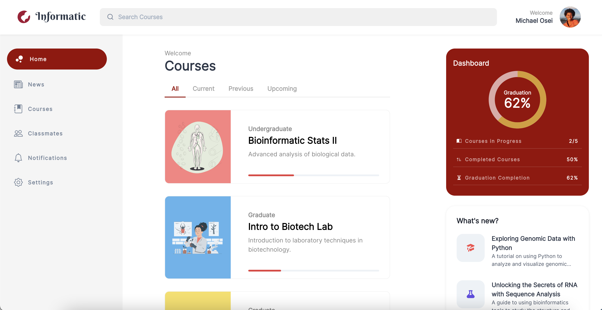
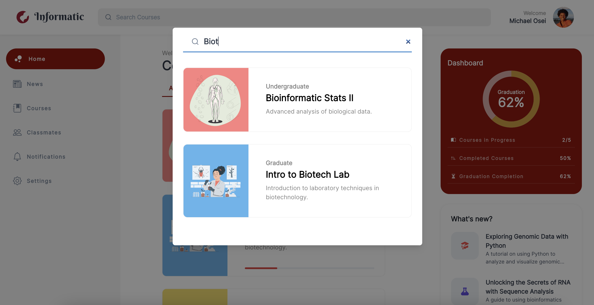
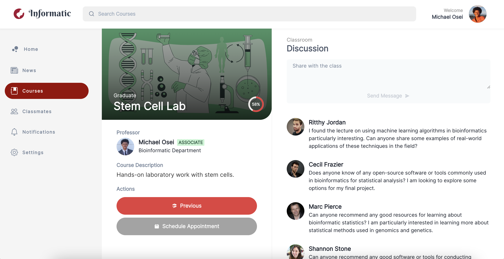
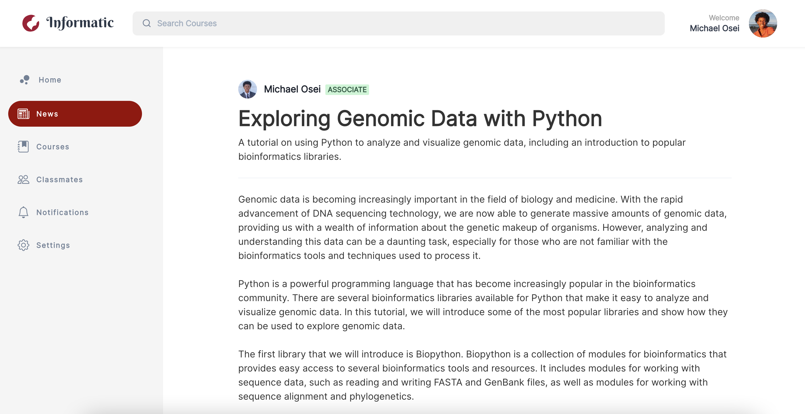
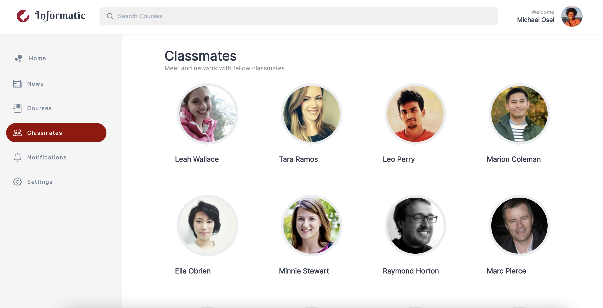
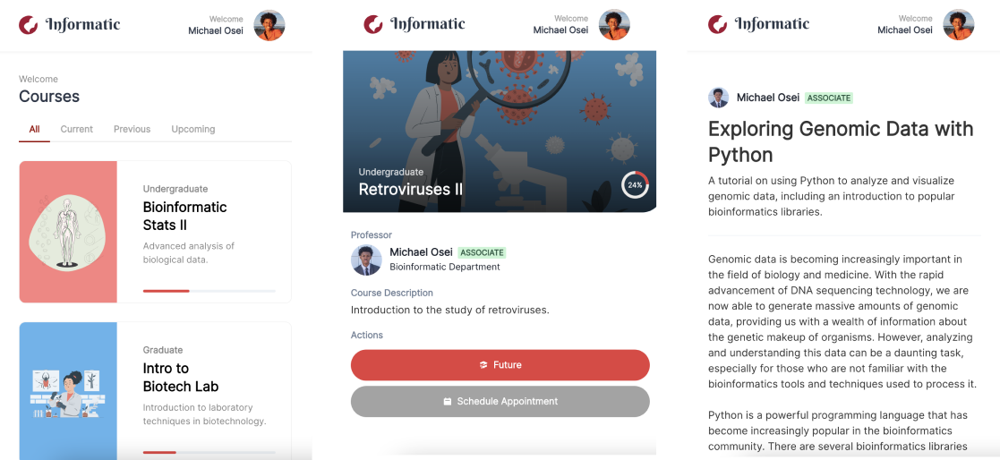

Informatic - The gateway to all of a learner's needs both today and tomorrow.
===

## Link
https://informatic.netlify.app/

## Description 
The goal of this learning portal is to serve as the one stop place for learners. Major features included full-text search of courses, discussion boards for students, contributing to discussion boards, filtering current courses from previous and future courses, detailed views for news / organizational updates, a classmates portal to explore all classmates, and various detailed views.

## Technical & Design • Achievements  
- ReactJS
- Typescript with all Types
- React-Router-Dom
- Full-text Search (Fuzzy Search) on all courses
- React Deployment to Netlify
- Discussion board with user input
- News feed including comments
- Tabs controller for filtering current, future, and previous courses
- Classmates hub featuring 70+ randomly selected users
- Courses hub displaying all courses
- News letter hub displaying all organization / program level updates
- User progress for courses
- User dashboard including course progress
- Aria-labels for all images and alt text for accessibility
- Full-responsive implementation with 4 breakpoints SM, MD, LG, and XL
- CSS grid and Flex-box usage
- UI elements (hover and active states across all inputs, buttons, sidebar menus)
- Modal implementation for search
- RandomUser API integration to load random users
- Created a singleton context state-management called classroom
- 6+ Pages
- Reusable components throughout the application
- Dynamic sidebar menu
- Current user menu popover
- SEO meta tags

## Major Features • Design & Development Decisions 
Here's a breakdown of all the main features that are in this project:

### Dashboard  

The dashboard is the learner lands. This includes a side navigation bar to navigate through the major components of the website, a main course section that allows the users to filter their courses based on the current, previous, and future courses, as well as an "All" overview tab. Included next to the main content section is a right side dash panel for quick statistics on where the user is at, as well as news updates that might be relavent to the user. All views are fully responsive and you'll notice that resizing the window will showcase different content.

### Search  

Included in the Appbar we have a search component that does full-text search on all the course titles and descriptions that are within the datastore. This is a quick way to navigate through courses and it is the core of the application, which made it a reasonable case to keep throughout the entire applicaiton. Here in the Appbar we have some usage of the Gestalt Principles (ie: proximity, closure, and continuation). You'll notice there's no use of borders with the Appbar, we leveraged closure instead to keep a minimalistic feel. The search leverages a Modal as well to allow users to not have to leave each page. They're always a few clicks away from their next destination.

### Discussion Board / Course Details

In this component we have a quick overview of the course that the user is on. There are some actions that are present as well as a discusion board. You'll notice the input to create a new discussion board is disabled until the user inputs some values to prevent empty API (HTTP Post Request). The data that is being fetched for the discussion board is from the external RandomUser.me API which is our base external API for loading users in this application. Every time a user navigates to the discussion board or course view new data is rendered. This view is fully responsive and on mobile you'll see that the viewpoint simply collapse in a flexbox style.

### News Detail View  

Along with courses. Informatic includes a news detail view. This news detail page includes a comment section which fetches from RandomUser.me. Generally with Informatic it's important to have a way to share marketing news as well as educational content and the news section provides this. Similar to a Medium blog post Informatic renders blogs that are performant for web and mobile.    

### Classmates 

One important component that was needed for Informatic was the classmates view. Here there is a suite of users that are rendered directly from our external api RandomUser.me. About 70~ random users are selected and then filtered out for uniques and displayed. This hopefully gives a sense of who's learning and educationally growing alongside the target student.

## Responsive Design Screenshots 

## Future Enhancements  
- Full Authentication leveraging JWT tokens if we want a mobile integration or Ouath 2 if we are looking at a full session based implementation.
- Advanced search on any update, newsletter, course and classmates. Informatic could leverage elastic search based on the size of the dataset.
- Stripe integration for subscription payments.
- Implement a settings and billing dashboard for miscellaneous inputs.
- Email based notification system based on user opt-in.
- Sendgrid (email management system) implementation to send out emails to students.
- Extended user growth metrics to track their progress. Informatic could leverage D3 to implement various data visualizations.
- Our LMS can include appointments scheduling as well availability management.
- Custom video component for serving video lessons.
- Canvas integration for enablement of a grading api.

## Open Source Packages / Libraries Used
Special thanks to ReactJS, Storyset, RandomUser.me, ReactIcons, Logopony, SVG2JSX, Chakra UI, ChatGPT.

- Helper for all illustrations used(Illustrations) https://storyset.com/people
- Icon Library for all icons used (Icons) https://react-icons.github.io/react-icons/
- Design inspiration for the logo (Logo) https://www.logopony.com/
- Design Framework used to build this project (Design framework) https://chakra-ui.com/
- Converted an SVG logo to JSX (Logo) https://svg2jsx.com/
- External API for generating fake users for this application (API) https://randomuser.me/
- Hosted the website (Public Host) https://www.netlify.com/
- Helped generate text. (Lorem Ipsum Alternative) https://chat.openai.com/chat

Without you all this application would not be possible.

## Deploy Locally
### `yarn install`
Adds all the dependencies needed to run this project in the development mode.\

### `yarn start`

Runs the app in the development mode.\
Open [http://localhost:3000](http://localhost:3000) to view it in the browser.

The page will reload if you make edits.\
You will also see any lint errors in the console.

### `yarn test`

Launches the test runner in the interactive watch mode.\
See the section about [running tests](https://facebook.github.io/create-react-app/docs/running-tests) for more information.

### `yarn build`

Builds the app for production to the `build` folder.\
It correctly bundles React in production mode and optimizes the build for the best performance.

The build is minified and the filenames include the hashes.\
Your app is ready to be deployed!

See the section about [deployment](https://facebook.github.io/create-react-app/docs/deployment) for more information.
