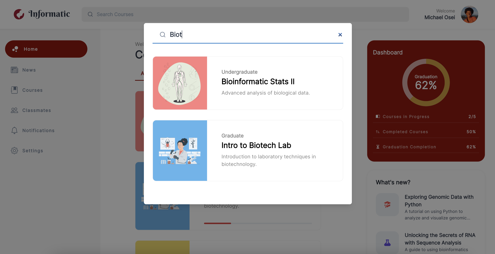
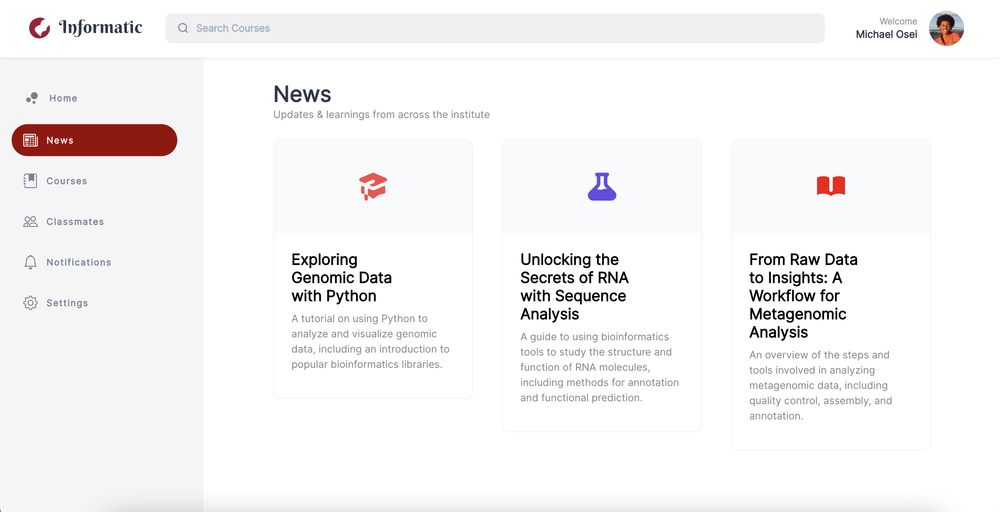
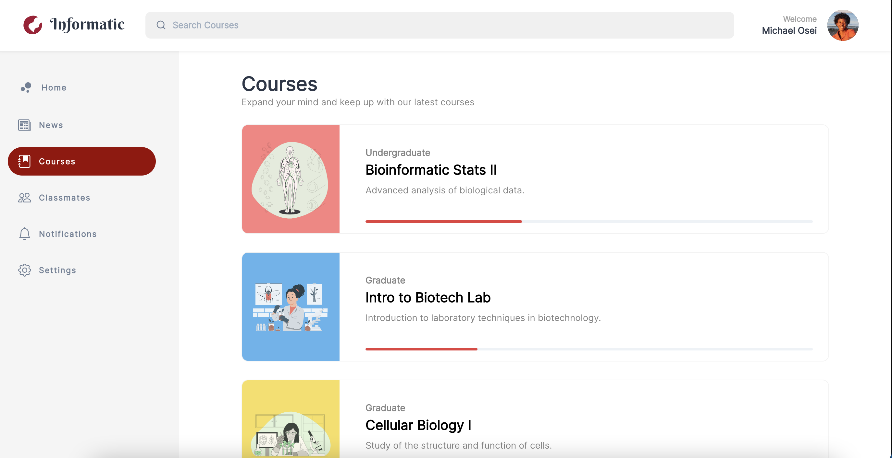

Informatic - The gateway to all of a learner's needs both today and tomorrow.
===

## Link
https://informatic.netlify.app/

## Description 
The goal of this learning portal is to serve as the one stop place for learners. Major features included full-text search of courses, discussion boards for students, contributing to discussion boards, filtering current courses from previous and future courses, detailed views for news / organizational updates, a classmates portal to explore all classmates, and various detailed views.

## Technical & Design • Achievements  
- ReactJS
- Typescript with all Types
- React-Router-Dom
- Full-text Search (Fuzzy Search) on all courses
- React Deployment to Git-pages
- Discussion board with user input
- News feed including comments
- Tabs controller for filtering current, future, and previous courses
- Classmates hub featuring 70+ randomly selected users
- Courses hub displaying all courses
- News letter hub displaying all organization / program level updates
- User progress for courses
- User dashboard including course progress
- Aria-labels for all images and alt text for accessibility
- Full-responsive implementation with 4 breakpoints SM, MD, LG, and XL
- CSS grid and Flex-box usage
- UI elements (hover and active states across all inputs, buttons, sidebar menus)
- Modal implementation for search
- RandomUser API integration to load random users
- Created a singleton context state-management called classroom
- 6+ Pages
- Reusable components throughout the application
- Dynamic sidebar menu
- Current user menu popover

## Major Features • Design & Development Decisions 
...

### Dashboard  

...
### Search  

...

### Discussion Board / Course Details

...
### News Detail View  

...
### Classmates 

...

## Future Enhancements  
- Full Authentication leveraging JWT tokens if we want a mobile integration or Ouath 2 if we are looking at a full session based implementation.
- Advanced search on any update, newsletter, course and classmates. We could leverage elastic search based on the size of the dataset.
- Stripe integration for subscription payments.
- Implement a settings and billing dashboard for miscellaneous inputs.
- Email based notification system based on user opt-in.
- Sendgrid (email management system) implementation to send out emails to students.
- Extended user growth metrics to track their progress. We could leverage D3 to implement various data visualizations.
- Our LMS can include appointments scheduling as well availability management.
- Custom video component for serving video lessons.
- Canvas integration for enablement of a grading api.

## Open Source Packages / Libraries Used
Special thanks to ReactJS, Storyset, RandomUser.me, ReactIcons, Logopony, SVG2JSX, Chakra UI, ChatGPT.

- Helper for all illustrations used(Illustrations) https://storyset.com/people
- Icon Library for all icons used (Icons) https://react-icons.github.io/react-icons/
- Design inspiration for the logo (Logo) https://www.logopony.com/
- Design Framework used to build this project (Design framework) https://chakra-ui.com/
- Converted an SVG logo to JSX (Logo) https://svg2jsx.com/
- External API for generating fake users for this application (API) https://randomuser.me/
- Hosted the website (Public Host) https://pages.github.com/
- Helped generate text. (Lorem Ipsum Alternative) https://chat.openai.com/chat

Without you all this application would not be possible.

## Screenshots 
User scenarios taking you through the learning experience 

Platform Dashboard, every user has to start from somewhere :D

Detail course view

Modal search throughout the application

Detail news letter view

News letter dashboard

Course page dashboard

Members page dashboard

## Deploy Locally
### `yarn install`
Adds all the dependencies needed to run this project in the development mode.\

### `yarn start`

Runs the app in the development mode.\
Open [http://localhost:3000](http://localhost:3000) to view it in the browser.

The page will reload if you make edits.\
You will also see any lint errors in the console.

### `yarn test`

Launches the test runner in the interactive watch mode.\
See the section about [running tests](https://facebook.github.io/create-react-app/docs/running-tests) for more information.

### `yarn build`

Builds the app for production to the `build` folder.\
It correctly bundles React in production mode and optimizes the build for the best performance.

The build is minified and the filenames include the hashes.\
Your app is ready to be deployed!

See the section about [deployment](https://facebook.github.io/create-react-app/docs/deployment) for more information.
